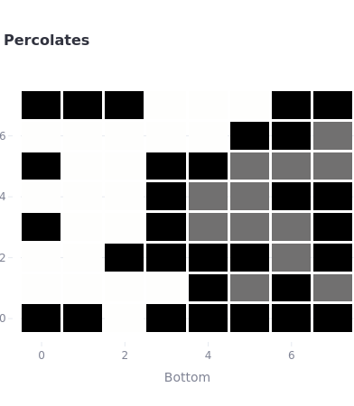
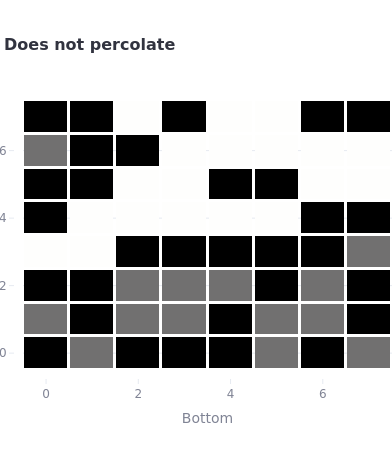

# Streamlit Application for Monte-Carlo Simulation To Estimate the Value of Percolation Threshold

This repository is created to submit MLH's Month Long Hackathon. I got the inspiration [from the Percolation assignment in Coursera's Algorithms 1 course from Princeton](https://coursera.cs.princeton.edu/algs4/assignments/percolation/specification.php).

Some systems from the test files are visualized and used to test the quick union implementations, which are used the connectivity between points in the system. The test files are downloaded from [the link](https://coursera.cs.princeton.edu/algs4/assignments/percolation/faq.php).

Apart from the visualization, it shows how the percolation threshold converges with increasing number of rows, columns and statistical experiments. As a new simulation is added, it is tabulated in the same table to make a comparison of their standard deviations, means and confidence intervals.
## What is percolation?

Also, Percolation theory helps describe phenomena where connectivity occurs through a medium. This medium is a random system comprised of n-by-m grid of sites and connections between sites. The network can represent a porous material, a network of pipes, a social network, or even a computer network. That is why it has applications in various fields, including physics, mathematics, material science, and computer science. 
For instance, the image depicts a system with 8-by-8 grid sites, which is percolated. The sites in gray are open sites but not connected to the top. The white sites are full sites (both open and connected to the top). Black sites are not opened.

To be percolated vertically (from top to bottom), at least one of the bottom sites should be full (white). 
 

As an example, the system with the same size that is not percolated is shown in the below. 

##  Monte-Carlo Simulation for the estimation of the percolation threshold
Each heatmap representation is one statistical experiment. However if sufficiently large number of computations(at least 30) is performed, the percolation threshold is computed averaging of the fraction of sites opened when the system with n-by-m grid sites is percolated. 

